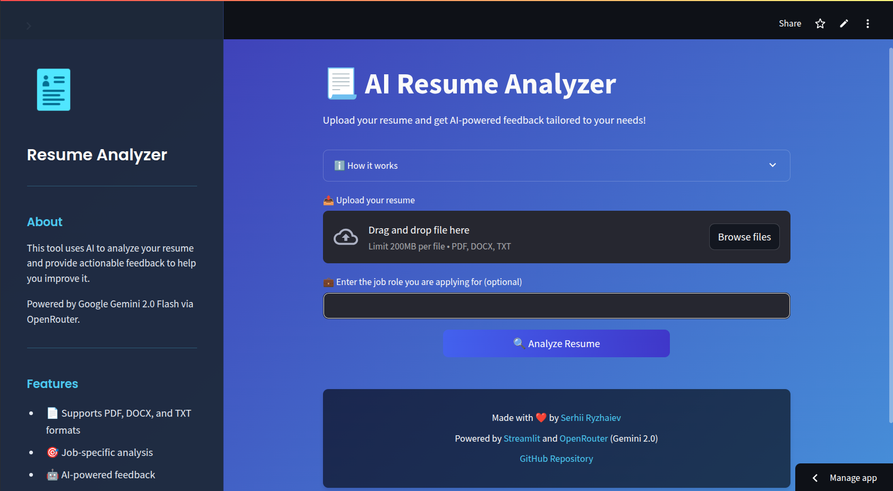

# 📃 AI Resume Analyzer


[](https://github.com/astral-sh/uv)
[](https://github.com/astral-sh/ruff)
[](https://github.com/pre-commit/pre-commit)
[](https://github.com/RYZHAIEV-SERHII/resume-analyzer/actions)
[](LICENSE)
[](CONTRIBUTING.md)

An innovative AI-powered tool crafted to evaluate resumes and provide tailored, actionable insights, empowering job seekers to refine their applications.

## ✨ Features

- **Smart Document Processing**: Upload resumes in PDF, DOCX, or TXT format
- **Job-Specific Analysis**: Customize feedback for specific job roles and industries
- **Comprehensive Feedback**: Get detailed AI analysis on:
  - Content clarity and impact
  - Skills presentation and relevance
  - Experience descriptions and achievements
  - ATS (Applicant Tracking System) optimization
  - Targeted improvements for specific roles
- **Clean, Modern UI**: User-friendly interface built with Streamlit
- **Privacy-Focused**: Your resume data is not stored or shared

## 🖼️ Screenshot


[](https://a1-resume-analyzer.streamlit.app/)

## 🚀 Installation

### Prerequisites

- Python 3.13+
- OpenRouter API key

### Setup

1. Clone the repository:

   ```bash
   git clone https://github.com/RYZHAIEV-SERHII/resume-analyzer.git
   cd resume-analyzer
   ```

2. Install uv if not installed:

   ```bash
   pip install uv
   ```

3. Install dependencies and setup virtual environment using UV:

   ```bash
   uv sync
   ```

4. Create a `.env` file with your OpenRouter API key:

   ```env
   OPENROUTER_API_KEY=your_api_key_here
   ```

## 💻 Usage

Run the application:

```bash
uv run streamlit run main.py
```

Then open your browser at <http://localhost:8501>

## 🏗️ Project Structure

```plaintext
resume-analyzer/
├── .env                            # Environment variables
├── .pre-commit-config.yaml         # Pre-commit hooks configuration
├── .python-version                 # Python version file
├── CHANGELOG.md                    # Project changelog
├── LICENSE                         # MIT license file
├── README.md                       # Project documentation
├── main.py                         # Entry point for the application
├── pyproject.toml                  # Project configuration and dependencies
├── uv.lock                         # UV lock file
├── src/                            # Source code
│   ├── services/                   # Core services
│   │   └── ai_analyzer.py          # AI analysis functionality
│   ├── static/                     # Static assets
│   └── utils/                      # Utility functions
│       ├── text_extractor.py       # Text extraction from different formats
│       └── ui_utils.py             # UI helper functions
└── tests/                          # Test suite
    ├── conftest.py                 # Test configuration and fixtures
    ├── services/                   # Service tests
    │   └── test_ai_analyzer.py
    └── utils/                      # Utility tests
        ├── test_text_extractor.py
        └── test_ui_utils.py
```

## 🛠️ Technologies Used

- **Streamlit**: For the web interface
- **Google Gemini 2.0 Flash**: For AI-powered resume analysis (via OpenRouter)
- **OpenRouter**: For accessing various AI models
- **pypdf**: For PDF text extraction
- **python-docx**: For DOCX file processing
- **UV**: For dependency management

## 🤝 Contributing

Contributions are welcome! Please feel free to submit a Pull Request.

1. Fork the repository
2. Create your feature branch (`git checkout -b feature/amazing-feature`)
3. Commit your changes (`git commit -m 'Add some amazing feature'`)
4. Push to the branch (`git push origin feature/amazing-feature`)
5. Open a Pull Request

## 📄 License

This project is licensed under the MIT License.
See the [LICENSE](LICENSE) file for more details.

## Contact

If you have any questions or suggestions,
feel free to reach out to me at [Email](mailto:rsp89@gmail.com) or [Telegram](https://t.me/CTAJIKEP)

### Happy coding!
